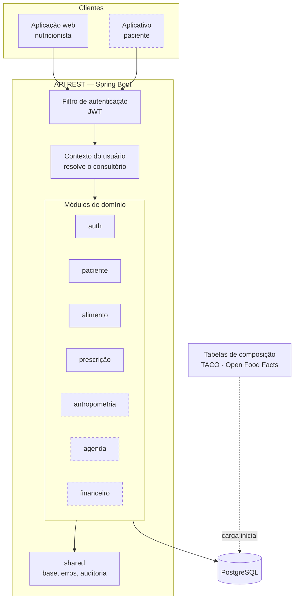
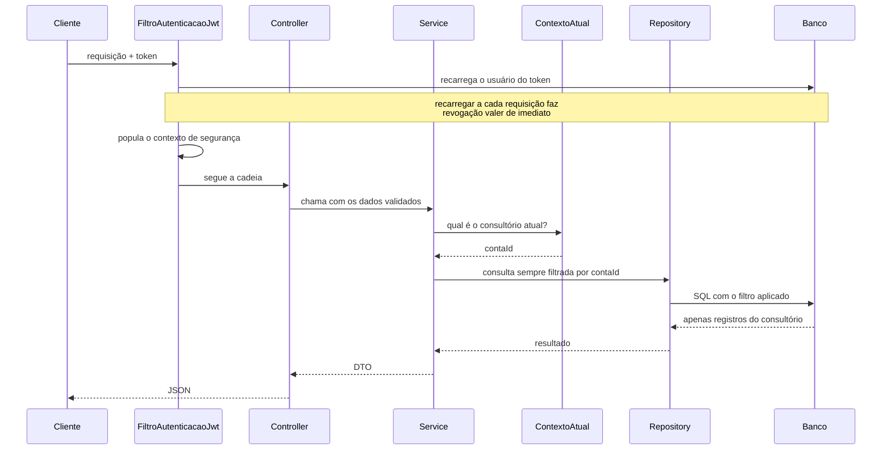

# Arquitetura

Sistema de gestão para consultórios de nutrição (NutriPlan).

---

## 1. Visão geral

O sistema é um **monólito modular** com API REST, servindo dois clientes: uma
aplicação web para o nutricionista e um aplicativo para o paciente.



Contorno tracejado indica módulo previsto e ainda não implementado.

### 1.1 Situação atual

| Camada | Estado |
|---|---|
| Módulos implementados | `auth`, `patient`, `food`, `prescription`, `anthropometry`, `schedule`, `finance`, `shared`, `config` |

| Tabelas | 12 |
| Endpoints | 48 |
| Testes automatizados | 125, todos passando |
| Interface | Aplicação React com 11 telas, incluindo a página do paciente |

---

## 2. Organização do código

O código é organizado **por contexto de domínio**, não por camada técnica.

```
br.com.nutriplan
├── auth/          autenticação, conta, plano de assinatura
├── paciente/      cadastro e prontuário
├── alimento/      composição, porções, importação
├── prescricao/    plano alimentar, cálculo, entrega ao paciente
├── shared/        entidade base, erros, auditoria
└── config/        segurança, CORS, documentação
```

Cada módulo de domínio repete internamente a mesma divisão:

```
alimento/
├── domain/        entidades e regras (Alimento, ComposicaoNutricional, Nutriente)
├── repository/    acesso a dados
├── service/       orquestração e regras de aplicação
├── dto/           contratos de entrada e saída da API
└── web/           controladores REST
```

**Por que assim.** A alternativa comum — pacotes `controllers`, `services`,
`repositories` no topo — agrupa o que muda por motivos diferentes e separa o que
muda junto. Ao alterar a regra de prescrição, o desenvolvedor navega três pastas.
Organizando por domínio, uma mudança de regra fica contida em uma pasta, e a
fronteira entre módulos permanece visível: se `schedule` passar a importar
`prescricao.repository`, o acoplamento salta aos olhos na revisão.

Essa organização também prepara uma eventual extração de serviços, sem exigi-la:
os módulos já são as costuras naturais de corte.

---

## 3. Fluxo de uma requisição



O ponto crítico está no meio: **o identificador do consultório nunca vem do
cliente**. Ele é derivado do usuário autenticado, no servidor. Um cliente
malicioso não tem por onde informá-lo.

---

## 4. Decisões arquiteturais

Cada decisão registra o problema, a escolha e o que se abre mão.

---

### AD-01 · Isolamento entre consultórios por coluna discriminadora

**Problema.** Dado clínico é sigiloso. Um consultório jamais pode alcançar o
paciente de outro, e a falha aqui é a mais grave que o sistema pode ter.

**Alternativas.** Um banco por consultório; um esquema por consultório; uma
coluna discriminadora compartilhada.

**Decisão.** Coluna `account_id` em toda tabela de dado clínico, com o filtro
aplicado em **todo método de repositório**, sem exceção.

```java
Optional<Paciente> findByIdAndContaId(Long id, Long contaId);
```

Não existe consulta sem o filtro. Isso é deliberado: uma consulta "só de leitura,
só para um relatório" sem o filtro é exatamente por onde o vazamento acontece.

**Custo.** A garantia depende de disciplina no repositório, e não do banco. Um
método novo escrito sem o filtro fura o isolamento silenciosamente. Mitigação:
testes que simulam acesso cruzado e exigem 404, executados a cada build.

**Evolução possível.** Row-Level Security do PostgreSQL moveria a garantia para
o banco, tornando-a independente de disciplina. Não foi adotado agora porque o
H2 usado em desenvolvimento não o suporta, o que quebraria a paridade entre
ambientes.

---

### AD-02 · Acesso cruzado responde 404, não 403

**Problema.** Responder "403 — proibido" a uma tentativa de acesso a registro
alheio confirma que aquele registro existe. Iterando identificadores, um atacante
mapeia a base de outro consultório sem ler um único dado.

**Decisão.** Toda tentativa de acesso cruzado responde **404**, indistinguível de
um identificador inexistente. Internamente a distinção é registrada em log, para
que a tentativa seja detectável.

**Custo.** Depuração fica menos direta — um 404 legítimo e uma violação de acesso
se parecem para quem chama. O log resolve para quem opera.

---

### AD-03 · Valores nutricionais em `BigDecimal`

**Problema.** Um plano alimentar soma centenas de parcelas. Em ponto flutuante
binário, valores decimais como 0,1 não têm representação exata, e o erro se
acumula ao longo das somas.

**Decisão.** `BigDecimal` em toda a composição nutricional, com escala de
arredondamento explícita nos resultados de cálculo.

**Custo.** Aritmética verbosa e mais lenta que `double`. Num sistema clínico, a
exatidão do número que o profissional assina vale mais que o desempenho.

---

### AD-04 · Ausência de dado é nula, nunca zero

**Problema.** Tabelas de composição trazem nutrientes não determinados. Gravar
zero nesses campos transforma "não sabemos" em "não contém" — uma afirmação
clínica falsa. Um alimento não analisado apareceria como isento de sódio.

**Decisão.** Nutriente não determinado permanece nulo, é omitido da resposta da
API, e a interface deve exibir "não informado".

**Consequência no cálculo.** Ao somar uma refeição, ausente somado a presente
devolve o presente — um alimento sem dado de zinco não pode zerar o zinco dos
demais. O efeito colateral é que o total vira um **piso**, não um valor exato.
Por isso a composição sabe relatar quais nutrientes ficaram incompletos, para que
o total seja apresentado com essa ressalva em vez de fingir precisão.

---

### AD-05 · Catálogo de nutrientes em vez de campos posicionais

**Problema.** A composição tem 32 nutrientes. Escalar e somar exigiam repetir os
32 campos em cada operação, e a montagem usava um construtor de 32 argumentos
posicionais — onde trocar dois nutrientes de lugar não gera erro de compilação
nem falha de teste evidente, apenas resultados errados.

**Decisão.** Um catálogo declara cada nutriente uma vez, com rótulo, unidade,
grupo e os acessores. Escalar, somar e serializar percorrem o catálogo.

```java
n("sodioMg", "Sódio", "mg", Grupo.MINERAL,
        ComposicaoNutricional::getSodioMg, ComposicaoNutricional::setSodioMg)
```

**Ganho.** Incluir um nutriente passa a ser uma linha no catálogo, uma coluna na
migration e um par de acessores — e ele já aparece na API, no cálculo e na
importação. A classe de risco "nutriente trocado de posição" deixa de existir.

**Custo.** Acesso por referência a método em vez de campo direto, com custo de
desempenho irrelevante nesta escala.

---

### AD-06 · Base de alimentos compartilhada com sobreposição por consultório

**Problema.** As tabelas de referência são idênticas para todos os consultórios —
duplicá-las por conta desperdiçaria espaço e tornaria impossível corrigir um dado
uma única vez. Mas o nutricionista precisa cadastrar alimentos próprios e ajustar
porções à sua prática.

**Decisão.** `account_id` **nulo** identifica registro do acervo comum, visível a
todos; preenchido, registro do consultório. A consulta combina os dois:

```sql
where conta_id is null or conta_id = :conta
```

Alimento do acervo não é editável — o consultório cria o seu a partir dele.
Porções seguem a mesma regra, com um detalhe: a porção do consultório **aparece
antes** da equivalente do acervo, porque quando o profissional define a sua
versão de "colher de sopa", é a dele que vale no atendimento dele.

**Por que a porção precisou disso.** As tabelas de composição publicam valores por
100 g, mas não publicam porções usuais. Sem esse mecanismo, o nutricionista não
conseguiria sequer registrar que "1 colher de sopa de arroz" pesa 25 g sobre um
alimento da base comum — e o plano sairia em gramas, ilegível para o paciente.

---

### AD-07 · Procedência do dado registrada em cada alimento

**Problema.** O nutricionista responde tecnicamente pelo que prescreve. Valor de
tabela nacional, rótulo de fabricante e estimativa própria não têm o mesmo peso, e
misturá-los sem distinção compromete essa responsabilidade. Há ainda a obrigação
de atribuição imposta pelas licenças das bases utilizadas.

**Decisão.** Todo alimento carrega sua fonte, que acompanha o dado até a
prescrição e os relatórios.

---

### AD-08 · Leitor de tabelas único para todas as fontes

**Problema.** Cada fonte de dados tem seu formato. Um importador por fonte
multiplicaria código de parsing quase idêntico, e amarraria o sistema às fontes
previstas em tempo de desenvolvimento.

**Decisão.** Um leitor único casa as colunas do arquivo contra o catálogo de
nutrientes, tolerando variações de grafia — `energyKcal`, `energy_kcal` e
`Energia (kcal)` chegam ao mesmo campo. Ele atende as cargas iniciais e também o
endpoint pelo qual o nutricionista envia a própria planilha.

**Ganho.** O sistema não depende de quais bases foram embarcadas. Qualquer tabela
que o profissional obtenha se torna importável.

**Restrição de projeto.** Arquivo enviado por um consultório entra **sempre**
vinculado a esse consultório, nunca no acervo comum — mesmo que declare fonte de
tabela oficial. Uma planilha enviada por um usuário não pode alterar o que os
demais enxergam.

---

### AD-09 · Autenticação sem estado, com usuário recarregado

**Problema.** Um token autocontido evita consulta de sessão, mas carrega uma
fotografia das permissões no momento da emissão. Desativar um usuário não teria
efeito até o token expirar.

**Decisão.** Token JWT sem sessão no servidor, mas o filtro **recarrega o usuário
do banco a cada requisição**, validando situação e perfil.

**Custo.** Uma consulta por requisição — o preço de revogação imediata, que num
sistema com dado clínico é inegociável.

---

### AD-10 · Esquema versionado, mapeamento validado

**Problema.** Geração automática de esquema a partir das entidades é conveniente
em desenvolvimento e perigosa em produção: uma renomeação de campo pode descartar
uma coluna com dados.

**Decisão.** Migrations Flyway como única fonte de verdade do esquema. O
mapeamento é apenas **validado** contra o banco no start — divergência impede a
aplicação de subir, em vez de alterá-lo silenciosamente.

---

### AD-11 · Paridade entre desenvolvimento e produção

**Problema.** O ambiente de desenvolvimento precisa subir sem instalação de
banco, mas divergir do banco de produção esconde defeitos até o deploy.

**Decisão.** H2 em modo de compatibilidade PostgreSQL para desenvolvimento e
teste; PostgreSQL em produção. As migrations ficam restritas a um subconjunto de
SQL que ambos aceitam.

**Custo assumido.** A compatibilidade não é perfeita. Recursos específicos do
PostgreSQL — Row-Level Security, tipos JSON, busca textual — ficam indisponíveis
enquanto essa paridade for mantida. É o que motiva a ressalva registrada em AD-01.

---

### AD-12 · Exclusão lógica para dado clínico

**Problema.** Prontuário, prescrições e lançamentos financeiros de um paciente
precisam sobreviver ao encerramento do acompanhamento, por exigência de guarda e
por integridade referencial.

**Decisão.** Paciente e alimento são **inativados**, nunca removidos. Saem das
listagens padrão e continuam acessíveis e reativáveis.

---

### AD-13 · Plano único, endereçado por identificador opaco

**Problema.** O plano precisa ser visto pelo nutricionista e pelo paciente. Manter
uma cópia para cada audiência criaria duas verdades que divergem na primeira
correção. Mas o paciente não tem conta no sistema, e exigir cadastro para ler a
própria dieta seria atrito onde não cabe atrito.

**Decisão.** O plano é **uma entidade só**. O que muda é o caminho de acesso: o
profissional entra autenticado, o paciente abre por um `public_identifier`,
um UUID que funciona como endereço do plano.

O identificador é opaco de propósito. Com id sequencial, somar 1 ao link abriria
o plano do paciente seguinte — uma falha de sigilo explorável por qualquer um que
recebesse um link legítimo.

**Custo.** A autorização passa a ser a posse do link. Quem o encaminha, dá acesso.
Mitigação: o link é revogável — regerar o identificador invalida o anterior — e
apenas plano publicado é servido; rascunho responde 404 como se não existisse.

**Alternativa descartada.** Login para o paciente. Resolveria a revogação, mas
custaria um cadastro por paciente para uma leitura ocasional, e o abandono seria
alto. A troca foi deliberada: conveniência com revogação, em vez de segurança
com atrito.

---

### AD-14 · O peso prescrito é congelado, não derivado

**Problema.** O item guarda a porção escolhida ("3 colheres") e o peso em gramas.
Derivar o peso a cada leitura manteria tudo consistente — mas o consultório pode
corrigir depois quanto pesa a sua "colher de sopa". Se o peso fosse derivado, essa
correção reescreveria retroativamente planos já entregues a pacientes.

**Decisão.** O peso é calculado na edição e **gravado no item**. Corrigir a porção
no cadastro do alimento não altera plano já prescrito.

**Consequência.** Há redundância entre `quantidade × medida` e `grams`, e ela é
intencional: o que o paciente recebeu naquele dia é um documento, não uma consulta
viva ao cadastro atual.

**Limite conhecido.** Um plano em rascunho também não acompanha a correção, o que
pode surpreender quem está editando. O refinamento previsto é congelar apenas na
publicação, mantendo derivado enquanto o plano for rascunho.

---

### AD-15 · O cálculo nutricional existe em um lugar só

**Problema.** A tela de prescrição precisa mostrar totais enquanto o profissional
monta o plano. O caminho natural seria calcular no navegador para resposta
imediata — e passar a ter a mesma regra implementada duas vezes, em duas
linguagens.

**Decisão.** O cálculo vive **apenas no servidor**. A interface edita, grava e
exibe o total que recebe de volta.

**Custo.** O total só aparece depois de salvar, e a tela precisa avisar quando há
alterações não gravadas — o que ela faz.

**Por que vale.** Duas implementações da mesma regra divergem em arredondamento,
em tratamento de dado ausente, em ordem de soma. Num sistema clínico, a divergência
apareceria como um número na tela do profissional diferente do número no plano do
paciente. O único jeito de garantir que são iguais é existir um só.

*(A interface reproduz apenas a conversão porção × quantidade, para dar retorno
imediato ao digitar. É aritmética trivial e verificada contra o servidor no
primeiro salvamento.)*

---

### AD-16 · Contrato público separado, e não filtragem do contrato interno

**Problema.** O plano do paciente não pode expor anotação interna do consultório
nem identificadores de conta. A abordagem usual — reutilizar o DTO interno e
remover campos na serialização — falha por omissão: um campo acrescentado depois
vaza até alguém lembrar de filtrá-lo.

**Decisão.** A resposta pública tem **contrato próprio**, que simplesmente não
possui campo para dado interno. Não há o que filtrar, porque não há o que remover.

**Ganho.** A proteção passa a ser estrutural, e não procedimental. Acrescentar um
campo interno ao plano não cria risco de vazamento, porque ele não tem por onde
chegar ao contrato público.

**Verificação.** Um teste abre o link e afirma que o corpo não contém o texto da
anotação interna nem a palavra `accountId`, e que contém a orientação ao paciente.

---

### AD-17 · A busca ordena por relevância, não alfabeticamente

**Problema.** A base tem 23.945 alimentos, e a proporção entre as fontes é
desequilibrada: 21.377 industrializados contra 597 da TACO. Ordenada por nome,
a busca ficava inutilizável — "banana" devolvia "&Joy Frutas Banana + Cacau",
"leite" devolvia alfajor de doce de leite, e o alimento de referência não
aparecia entre os primeiros resultados.

Não era um problema de dados: era a consulta devolvendo o acervo em ordem
alfabética, onde o volume decide.

**Decisão.** Ordenação por relevância em três níveis, aplicada apenas quando há
termo de busca:

1. **Procedência** — TACO, depois TBCA e IBGE, e por último produto de
   fabricante. A TACO vem à frente do IBGE porque caracteriza o alimento
   básico; o IBGE complementa com preparações, que respondem quando o básico
   não basta — "feijoada" não existe na TACO.

2. **Como o termo casou** — o teste é por *palavra inteira*, não por prefixo.
   Sem isso, "arroz" devolvia "Arrozina" (um cereal infantil cujo nome apenas
   começa com as cinco letras) antes do arroz comum, porque o nome é mais curto.

3. **Tamanho do nome** — entre iguais, o nome curto tende a ser o alimento
   genérico.

O resultado é uma cascata: a busca desce de fonte em fonte até encontrar.

**Custo.** A ordenação vive na consulta, em `CASE WHEN` — verboso e específico.
E o `Pageable` precisa ir sem ordenação, senão o Spring Data anexa o sort do
cliente e anula o ranqueamento. Ambos os pontos estão comentados no código,
porque não são óbvios em leitura rápida.

**Alternativa descartada.** Busca textual do PostgreSQL (`tsvector`), que daria
ranqueamento melhor. Barrada pela paridade com o H2 usada em desenvolvimento
(AD-11) — é a mesma restrição que adia o Row-Level Security.

---

## 5. Segurança

| Preocupação | Tratamento |
|---|---|
| Senhas | BCrypt, fator de custo 12 |
| Enumeração de usuários | Tempo de resposta uniforme no login; erro genérico |
| Enumeração de registros | Acesso cruzado responde 404 (AD-02) |
| Token comprometido | Usuário recarregado a cada requisição (AD-09) |
| Origem das requisições | CORS restrito a origens configuradas |
| Erros na cadeia de filtros | Tratados por handlers dedicados, para que 401 e 403 saiam com o mesmo formato do restante da API |

Exceções lançadas dentro da cadeia de filtros não passam pelo tratamento global
de erros do MVC. Sem handlers próprios, uma requisição sem credencial receberia
403 em vez de 401 — o padrão do framework quando não há ponto de entrada
configurado.

---

## 6. Testes

A estratégia privilegia **teste pela borda HTTP** em vez de teste unitário de
serviço. Os testes sobem a aplicação, autenticam de verdade e exercitam os
endpoints.

**Por quê.** O que precisa ser garantido são propriedades de ponta a ponta —
isolamento entre consultórios, exatidão do cálculo, formato do erro. Um teste
unitário de serviço com repositório simulado não verifica se a consulta filtra por
consultório, que é justamente o risco.

**Custo.** Suíte mais lenta e menos precisa em apontar a linha do defeito.
Aceitável na escala atual.

Casos que valem destaque:

- **Acesso cruzado**: dois consultórios são criados; o segundo tenta ler, editar e
  remover registro do primeiro, e deve receber 404 nas três operações, com
  listagem vazia.
- **Exatidão do cálculo**: a composição de uma porção é conferida contra o valor
  por 100 g multiplicado pelo fator, e não contra constantes fixadas no teste.
- **Ausência preservada**: um alimento sem energia determinada na fonte continua
  sem energia após o cálculo da porção, em vez de aparecer como zero.
- **Não vazamento pelo link**: o corpo servido ao paciente é lido como texto e
  verificado por ausência da anotação interna e do identificador de conta, e por
  presença da orientação ao paciente. Testar a ausência importa mais que a
  presença: é o que quebra quando alguém acrescenta um campo sem pensar.
- **Peso congelado**: a porção do alimento é corrigida depois da prescrição, e o
  teste exige que o plano já gravado mantenha o peso original.

Os cenários em linguagem natural que originam esses testes estão em
[04-cenarios-bdd.md](04-cenarios-bdd.md).

### AD-18 · Uma régua do dia como estrutura da interface

**Problema.** A interface era legível, mas anônima: fundo claro, serifada de
display, verde e regras de 1px — o mesmo desenho que qualquer sistema de saúde
recebe por padrão. E ignorava o fato mais forte do domínio: quase toda tela
aqui é um dia. A agenda é um dia de atendimentos, o plano é um dia de
refeições, o financeiro é um mês de dias.

A página do paciente sofria a consequência mais séria. Ela era a mesma pilha de
cartões da tela do nutricionista, com um cabeçalho colorido — apesar de os dois
públicos não terem nada em comum. O nutricionista lê a tela por horas, sentado,
procurando números. O paciente abre o link no celular, de pé na cozinha, para
responder uma pergunta: **quanto eu como agora?**

**Decisão.** Um único elemento estrutural, reaproveitado onde o conteúdo é um
dia: uma régua vertical com os horários reais fixados nela. Os blocos penduram
na linha, e o vão entre o café e o almoço aparece como vão de verdade. Está no
plano do paciente e na agenda, que deixou de ser tabela.

A régua é estrutura, não ornamento: a ordem que ela impõe é a ordem em que o
dia acontece, e o marcador é a hora prescrita — não um número de sequência.
Refeição sem horário definido recebe o rótulo "livre" em vez de uma hora
inventada.

Na página do paciente, a hierarquia dentro do item foi invertida: **a medida
caseira é o maior texto da tela**, acima do peso em gramas, que fica como nota
discreta. O paciente já sabe o que é arroz; o que ele não sabe é quanto. Isso
tornou a concordância da medida um problema de produto — "2 unidade" passa
despercebido numa tabela e salta aos olhos em corpo 22 —, resolvido em
`PluralMeasure`.

**Custo.** Duas telas passaram a depender de um mesmo componente visual que não
existe como componente de código, só como convenção de CSS (`.regua-dia`).
Se uma terceira tela adotar a régua com regras próprias, vale extrair.

**Alternativa descartada.** Manter a tabela na agenda. Ela acomoda mais colunas,
mas nega a informação principal: a distância entre um atendimento e o próximo.


### AD-19 · Tema claro e escuro sem tabela de cores duplicada

**Problema.** Um segundo tema costuma nascer como um bloco de tokens separado
que repete a tabela inteira. Duas tabelas divergem: alguém ajusta um tom no
claro, não lembra do escuro, e a diferença só aparece quando um usuário
reclama.

**Decisão.** Cada token guarda o par numa declaração só, com `light-dark()`:

```css
--pedra: #e7eae5;                        /* recuo: navegador antigo fica no claro */
--pedra: light-dark(#e7eae5, #151d19);   /* o par, na mesma linha */
```

Não existe bloco escuro. Mexer num tom obriga a olhar o outro, porque estão
lado a lado. A linha simples que antecede cada par é o recuo: navegador sem
`light-dark()` descarta a segunda declaração e continua no tema claro, em vez
de ficar sem valor nenhum.

Quem decide qual lado do par vale é `color-scheme`, declarado em três estados
na raiz — e ele faz mais do que alternar tokens: é o que manda o navegador
desenhar no tema certo o que não é nosso, o seletor de data, o menu do
`select`, a barra de rolagem. Este sistema é cheio dos três.

**Três estados, e não um interruptor.** "Sistema" é o padrão e continua
escolhível: um botão de dois estados obriga a fixar claro ou escuro para
sempre, e o aparelho do usuário troca sozinho ao anoitecer. A escolha é
aplicada por um script embutido no `index.html`, antes da primeira pintura —
se esperasse o React, quem fixou escuro veria um lampejo claro a cada
carregamento.

**Duas armadilhas que o tema escuro revelou:**

- `--breu` é a cor do trilho, escura nos dois temas. Também estava servindo de
  tinta para título e para a hora da régua, o que só funcionava no claro: no
  escuro virava preto sobre preto. A tinta de display virou token próprio.
- A cor de índice não sobrevive à inversão como um valor só. O tom que serve de
  fundo para o botão, sob texto branco, é ilegível como texto sobre fundo
  escuro. No escuro ela se divide em fundo, texto e marcador — três valores com
  a mesma matiz e claridades diferentes.

**De quebra, duas falhas antigas.** Medir contraste nos dois temas expôs
problemas que já existiam no claro: texto pequeno a 3,1:1 e borda de campo a
1,7:1. Ambos corrigidos, com contorno próprio para controle de formulário —
divisor de tabela pode ser fio claro, porque quem identifica a linha é o texto;
a borda de um campo não, porque ela é a única coisa que diz onde dá para
escrever.

**Custo.** `light-dark()` e `color-mix()` exigem navegador de 2024 em diante.
Em navegador anterior o sistema fica inteiro no tema claro — degradação
aceitável, e o motivo de cada par vir precedido do valor simples.


### AD-20 · Receita é um alimento, e não uma entidade paralela

**Problema.** A base tem 23.945 alimentos e nenhuma preparação. Dá para
prescrever arroz e brócolis separados, não "arroz com brócolis" — e o
nutricionista repete a mesma montagem em toda consulta.

O caminho óbvio seria uma entidade `Recipe` ao lado de `food`, com
ingredientes próprios. Mas então tudo que existe precisaria aprender a lidar
com duas coisas: a busca, a medida caseira, o item de refeição, o cálculo da
refeição, a procedência na prescrição. Cada um desses pontos ganharia um `if`.

**Decisão.** A receita **é** um `food`, com fonte `RECIPE` e composição
calculada em vez de tabelada. O que ela acrescenta são três colunas esparsas —
`instructions_mode`, `grams_yield`, `servings`, nulas nos 23.945 registros das
tabelas de referência — e a tabela `recipe_ingredient`.

A consequência é que nada precisou mudar: a receita aparece na busca, aceita
medida caseira, entra numa refeição e carrega "Receita calculada" na prescrição
pelo mesmo caminho que a TACO carrega o nome dela. Uma receita pode inclusive
ser ingrediente de outra — refogado dentro de torta — porque o ingrediente
aponta para um alimento, e receita é alimento.

**A conta que exige cuidado não é a soma.** É o denominador. A composição de um
alimento é sempre por 100 g, e o peso final da preparação não é a soma dos
ingredientes: 100 g de arroz cru viram cerca de 250 g cozido. Dividir pela soma
produziria uma composição duas vezes e meia mais concentrada que a realidade.
Por isso o rendimento é campo do nutricionista, e quando ele não informa, a
resposta marca `estimatedYield` em vez de apresentar o número como medido.

**Custo.** Colunas nulas na tabela maior do sistema, e um `food` que agora
tem dois modos de existir. O limite de profundidade de dez níveis na detecção
de ciclo é arbitrário — é grande o bastante para qualquer receita real e
pequeno o bastante para não percorrer um grafo torto.

**Alternativa descartada.** Materializar a receita como alimento no momento de
prescrever, mantendo as duas entidades separadas. Resolveria a busca, mas
duplicaria a composição em dois lugares — e a cópia divergiria na primeira
correção de ingrediente.


---

### AD-21 · A agenda sai por assinatura iCalendar, e não pela API do Google

**Problema.** O nutricionista já tem um calendário — no celular, no computador,
compartilhado com a secretária. Manter duas agendas é conferir duas agendas, e
uma delas fica desatualizada.

O caminho esperado é OAuth com o Google: pedir autorização, criar evento na
agenda dele por API. Isso exige credencial de aplicativo registrada, tela de
consentimento revisada pelo Google, e um segundo sistema de tokens — de
atualização, de expiração, de revogação — para manter em pé. E resolve **um**
calendário: Apple e Outlook exigiriam cada um o seu.

**Decisão.** Servir a agenda como feed iCalendar (RFC 5545) num endereço com
UUID, que Google Agenda, Apple Calendar e Outlook assinam nativamente. O
calendário busca o endereço de tempos em tempos e reflete o que mudou. Zero
credencial de terceiro, um formato para os três leitores.

**O que fica de fora, e está dito na tela.** O caminho de volta. Evento criado
no Google não vira atendimento aqui. É de mão única, e o requisito diz
"sincronizar" — a tela não deixa o profissional descobrir isso na prática, com
um horário perdido.

**Três exigências do formato quebram em leitor diferente**, e cada uma tem
teste:

- **A linha não passa de 75 octetos.** A continuação é quebra seguida de
  espaço. O corte é por byte, e não por caractere: cortar no meio de um "ç"
  produz lixo na tela do usuário.
- **O UID precisa ser estável entre buscas.** Se mudasse, o calendário apagaria
  e recriaria o evento a cada atualização — e o alerta tocaria de novo.
- **Vírgula, ponto e vírgula e barra têm significado.** Sem escapar, "Marina,
  Duarte e Silva" chega ao calendário cortada no primeiro sobrenome.

**A ressalva de segurança.** Quem tem o endereço vê a agenda, com nome de
paciente, sem senha. É a mesma autorização por posse de link do plano público
(AD-13), com as mesmas defesas: o endereço só existe depois de pedido, e
regenerá-lo invalida o anterior na hora.

**Custo.** Atraso de atualização: o Google busca feeds em intervalo próprio, que
pode chegar a algumas horas. Para uma agenda de consultório, onde o que muda é
o atendimento de amanhã, é aceitável. Se não fosse, a alternativa não seria
OAuth — seria notificação por e-mail.

---

### AD-22 · Imagem em coluna, em tabela separada da entidade

**Problema.** A orientação nutricional pede figura: um prato dividido, um
desenho de porção, uma lista de compras ilustrada. A figura vale mais que o
parágrafo que a descreve, e o texto sozinho perde metade do recado.

Onde o arquivo mora é a decisão. Objeto remoto (S3 e afins) é a resposta padrão,
e traz consigo credencial de nuvem, biblioteca de cliente, política de acesso e
uma dependência que precisa estar de pé para a página do paciente abrir. Disco
local traz o problema de backup: o dump do banco deixa de ser a cópia completa
do sistema.

**Decisão.** O binário vai em coluna `BYTEA`, numa **tabela própria** com chave
igual à da entidade dona — `handout_image` e `plan_image`. Limite de
2 MB, verificado no envio.

A tabela separada é o ponto. Blob na mesma tabela faz toda listagem de
orientações arrastar as figuras junto, mesmo quando ninguém vai vê-las; o custo
aparece na tela mais usada. Separado, a listagem lê `title`, `body` e um
booleano, e o arquivo só sai do banco quando alguém pede a figura.

**A cópia entregue é outra cópia.** `plan_image` guarda os bytes de novo,
e não uma referência à figura da biblioteca — mesma regra do texto (AD-14
aplicado a arquivo): trocar o desenho no modelo não pode mudar o que dezenas de
pacientes já receberam. O custo são algumas centenas de KB por plano.

**Consequência boa.** O backup do banco continua sendo a cópia completa do
sistema, e o ambiente de desenvolvimento não precisa de nuvem nenhuma para
rodar inteiro.

**Quando revisar.** Se a figura virar rotina em escala — dezenas por
consultório, milhares de planos — o volume passa a pesar no dump e na memória
do servidor de banco. O caminho então é objeto remoto guardando a referência que
`labtest_report` já antecipa, e não coluna maior.

---

### AD-23 · O erro é do servidor; onde ele aparece é da tela

**Problema.** A informação sobre o que deu errado existia inteira e chegava
truncada. O servidor sempre respondeu com o erro por campo — `campos: [{campo,
mensagem}]` — e a tela juntava tudo com `". "` numa frase única no topo do
formulário. Num formulário de vinte campos, ler *"O peso deve ser maior que
zero"* e ter de descobrir onde fica o peso é trabalho que o sistema empurrou
para quem usa.

Do outro lado, trinta frases de reserva — "Falha ao salvar.", "Não foi possível
concluir a operação." — diziam que algo falhou e nenhuma dizia o quê.

**Decisão.** Três camadas, com uma regra clara de quem escreve o quê:

1. **Regra de negócio e validação: o servidor escreve.** Quem escreveu a regra
   sabe explicá-la melhor que a tela. As respostas 400, 404, 405 e 422 são
   repassadas literalmente. Isso obrigou a corrigir a fonte: mensagens padrão do
   Bean Validation (*"tamanho deve ser entre 0 e 20"*) foram traduzidas de uma
   vez em `ValidationMessages.properties`, para todos os DTOs.
2. **Falha de transporte e de infraestrutura: a tela escreve**, porque só ela
   sabe o que se tentava fazer. `explicarErro(e, "salvar o paciente")` produz
   *"Sem resposta do servidor ao tentar salvar o paciente — nada foi
   alterado."* A última oração é a que importa: diz que não houve efeito
   parcial.
3. **Onde a mensagem aparece é decisão da tela.** Erro de campo gruda no campo,
   com `aria-invalid`, `aria-describedby` e o foco levado ao primeiro deles.
   O resto vai para a tira de recado.

**Erro interno virou 4xx onde era 4xx.** Rota inexistente, verbo errado, enum
desconhecido e JSON quebrado respondiam 500 "Ocorreu um erro inesperado", com
pilha inteira no log. Agora respondem 404, 405 e 400 — e o 400 nomeia o campo,
com o índice quando ele está dentro de uma lista
(`refeicoes[0].itens[1].quantidade`). Erro interno é uma afirmação sobre o
servidor; pedido malformado é uma afirmação sobre o pedido, e só a segunda
ajuda quem chamou a consertar o que fez.

**A confirmação leva a hora.** Depois de uma edição longa, a pergunta que a
pessoa faz não é *salvou?* — é *a minha última alteração entrou?*. "Salvo"
não responde isso; "Salvo às 14:32" responde. É o mesmo gesto da régua do dia
(AD-18): pendurar a informação numa hora real.

**Custo.** Dois contratos de mensagem para manter coerentes, e a tentação de
escrever a frase nos dois lugares. A regra de quem escreve o quê é o que impede
a duplicação — quando a tela repete o que o servidor já disse, a mensagem fica
mais longa e menos exata.

---

### AD-24 · Um degrau por conteúdo, e não por aparelho

**Problema.** O sistema tinha **um** ponto de quebra, em 900px, para toda a
interface. Consequências medidas, e não supostas:

| Largura | O que acontecia |
|---|---|
| 1920 | 464px de vazio só à direita — `max-width` sem centralização |
| 1024 | a página rolava 120px na horizontal; o nome do alimento ficava com 131px enquanto colunas fixas seguravam 330px |
| 768 | rolava 40px, e um iPad em retrato recebia o layout de celular |

**Decisão.** Quatro degraus, cada um no ponto em que **um arranjo específico
deixa de caber**, e não na largura nominal de um aparelho: 1180 (o painel
lateral cede), 900 (o editor vira coluna única), 760 (a linha do item vira duas
faixas), 600 (cartões em coluna). Nenhum deles é "tablet" ou "celular", porque
a mesma largura é as duas coisas dependendo de como a janela está.

**As três causas estruturais**, que valem mais que os degraus:

- **`minmax(0, 1fr)` em vez de `1fr`.** Faixa `1fr` tem mínimo automático: o
  filho cresce até o próprio min-content e empurra a página. O sintoma aparece
  na borda da tela, longe da causa.
- **Colunas que cedem juntas.** Colunas fixas não encolhem, então quem encolhe
  é a faixa flexível — e ela costuma carregar a informação principal.
- **`min-width: 0` no campo de formulário.** Sem isso ele para no próprio
  conteúdo e vaza da faixa que o hospeda.

**O piso, medido em vez de afirmado:** de 320px a 1920px, zero rolagem
horizontal (WCAG 1.4.10) e zero alvo abaixo de 24px (WCAG 2.5.8).

**Custo.** Quatro degraus é mais CSS para manter coerente que um. A defesa é
que os três consertos estruturais acima removem a maior parte da necessidade de
degrau — a maioria dos casos passou a caber sozinha.


---

## 7. Dívidas conhecidas

Registradas aqui por honestidade de engenharia — cada uma é decisão consciente,
não descuido.

| Dívida | Impacto | Encaminhamento |
|---|---|---|
| Isolamento depende de disciplina no repositório | Um método novo sem filtro fura o isolamento | Row-Level Security ao adotar PostgreSQL também em desenvolvimento |
| Perfis `ASSISTANT` e `PATIENT` modelados sem fluxo | Só o nutricionista usa o sistema hoje | `ASSISTANT` tem fluxo previsto (RF05). `PATIENT` não terá: o paciente acessa o plano pelo link público, sem conta — o enum permanece por já estar no esquema |
| Cargas iniciais rodam no start da aplicação | Primeiro start mais lento | Mover para comando administrativo separado |
| Suíte sobe o contexto completo | Tempo de build cresce com o número de testes | Separar testes de unidade dos de integração |
| Sem cache na busca de alimentos | Consulta ao banco a cada digitação | Avaliar após medir, não antes |
| Interface sem teste automatizado | Comportamento que só existe no cliente — a meta que vem da avaliação (RF68), a visão de semana (RF74) — é verificado à mão | Adotar teste de componente antes do próximo módulo que nasça na tela |
| Peso congelado também em rascunho | Corrigir a porção não reflete no plano em edição | Congelar apenas na publicação (ver AD-14) |
| Link do paciente é a única credencial | Quem recebe o link, encaminha o acesso | Revogação já existe; expiração por prazo é o próximo passo |
| Plano gravado por substituição integral | A tela envia o plano inteiro a cada gravação | Aceitável no volume de um plano; revisar se crescer |
| Erro por campo só em formulário de campo fixo | O editor de plano valida listas aninhadas, e ali a mensagem vai para uma lista traduzida em vez de grudar no campo | Aceitável: o caminho `refeicoes[0].itens[1]` é traduzido para "Almoço, 2º alimento" |
| Binário de imagem e laudo em coluna do banco | O dump cresce com o uso, e o servidor de banco carrega o arquivo na memória para servi-lo | Objeto remoto quando o volume pesar (ver AD-22) |
| Atualização do calendário externo tem atraso | O leitor busca o feed em intervalo próprio, que pode chegar a horas | Aceitável para agenda de consultório; ver AD-21 |

---

## 8. Tecnologias

| Camada | Escolha | Motivo |
|---|---|---|
| Linguagem | Java 21 | Tipagem forte e verificação em tempo de compilação, adequadas a um domínio com muitas regras |
| Framework | Spring Boot 3.4 | Ecossistema maduro para API REST, segurança e persistência |
| Persistência | Spring Data JPA / Hibernate | Mapeamento objeto-relacional com consultas declarativas |
| Migrations | Flyway | Versionamento do esquema (AD-10) |
| Banco | PostgreSQL / H2 | Produção e desenvolvimento (AD-11) |
| Autenticação | Spring Security + JWT | Sem estado, com revogação imediata (AD-09) |
| Documentação da API | springdoc-openapi | Contrato navegável em `/docs` |
| Geração de PDF | OpenPDF 2.2 | Fork LGPL/MPL do iText 4. O iText 7 é AGPL, o que obrigaria a abrir qualquer sistema que o use |
| Testes | JUnit 5, MockMvc, AssertJ | Teste pela borda HTTP |
| Interface | React 18, TypeScript, Vite | Tipagem estática também no cliente, coerente com a escolha do backend |
