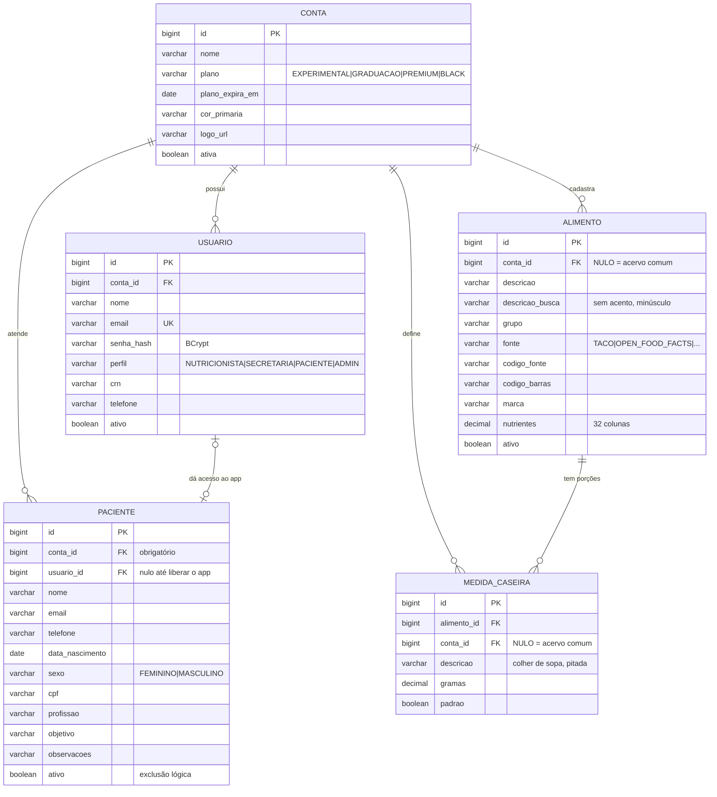
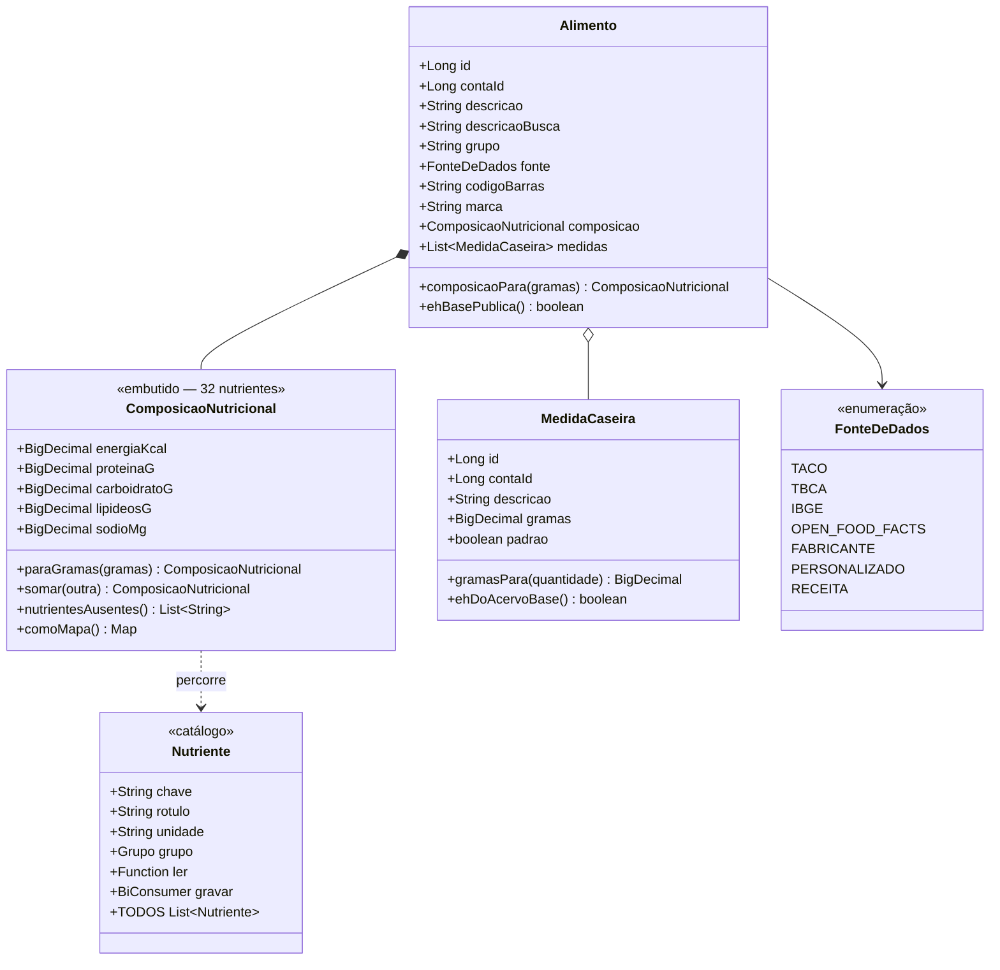
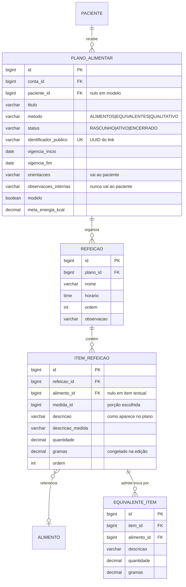
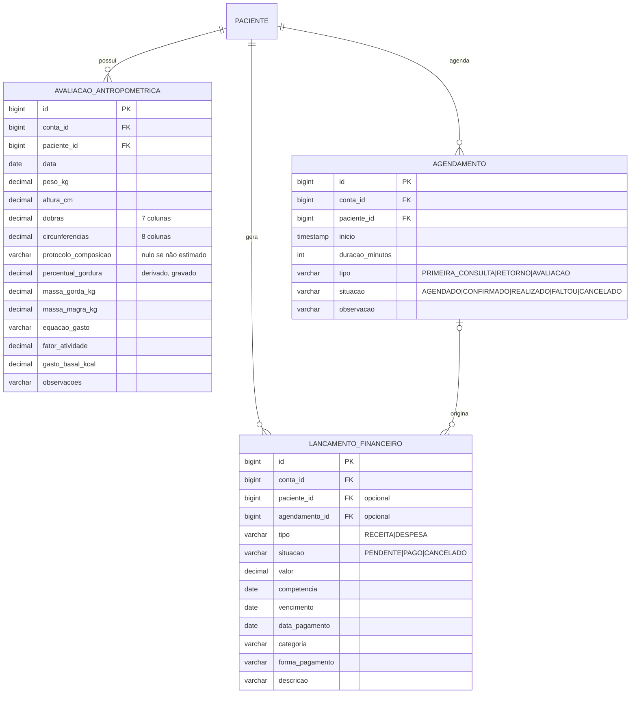
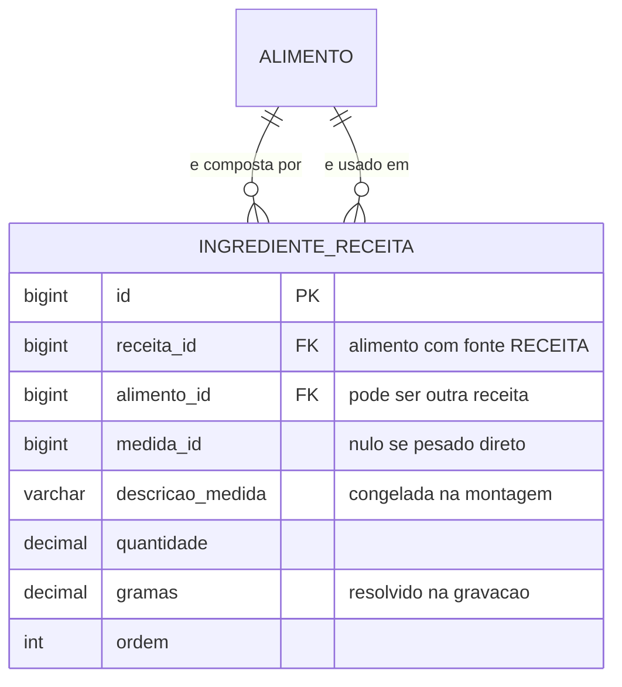
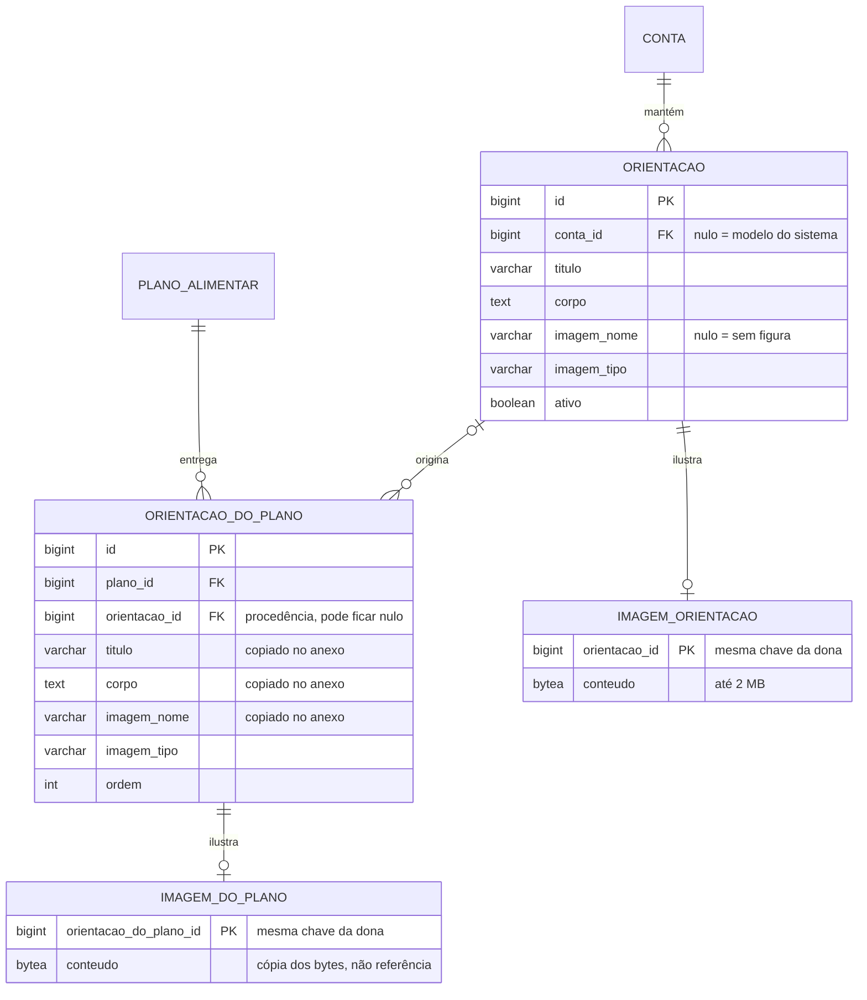
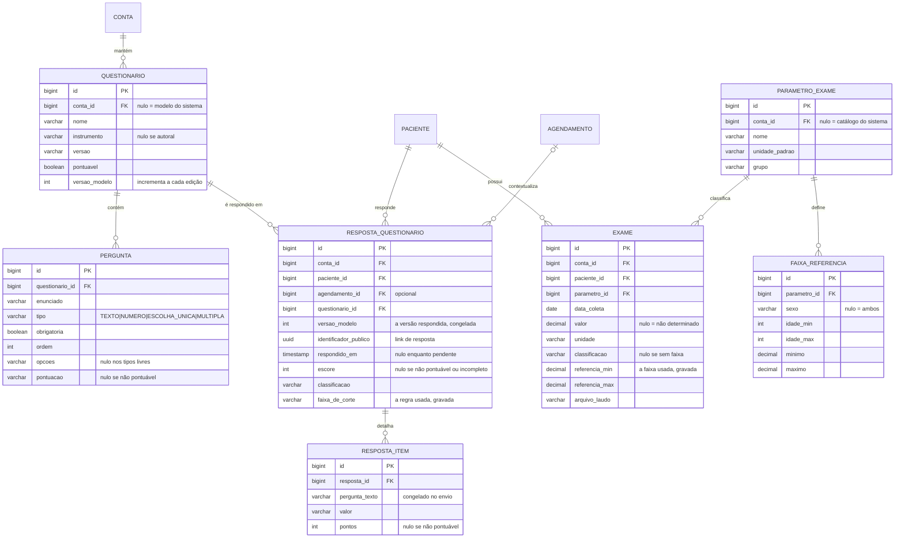

# Modelo de Dados

Sistema de gestão para consultórios de nutrição (NutriPlan).

Este documento descreve o modelo **implementado** nas seções 1 a 6. A modelagem
dos módulos ainda não construídos está na seção 7, marcada como tal.

---

## 1. Modelo entidade-relacionamento — implementado



Toda tabela carrega ainda quatro colunas de auditoria — `created_at`,
`updated_at`, `created_by`, `updated_by` — preenchidas automaticamente com
o instante e o e-mail do usuário autenticado. Foram omitidas do diagrama por
repetição.

---

## 2. As duas colunas que estruturam o modelo

### 2.1 `account_id` — o eixo de isolamento

Toda tabela de dado clínico tem `account_id`, e toda consulta filtra por ela. É o
mecanismo que impede um consultório de alcançar dados de outro.

O comportamento muda conforme a coluna aceite nulo:

| Tabela | `account_id` | Significado |
|---|---|---|
| `patient` | **obrigatório** | Paciente pertence a exatamente um consultório. Não existe paciente compartilhado. |
| `food` | **opcional** | Nulo = acervo comum, visível a todos. Preenchido = cadastro do consultório. |
| `household_measure` | **opcional** | Nulo = porção que acompanha o sistema. Preenchido = porção do consultório. |

A consulta que combina os dois casos:

```sql
where conta_id is null or conta_id = :conta
```

Essa distinção não é detalhe de implementação: é o que permite compartilhar as
tabelas de composição — idênticas para todos — sem impedir que cada profissional
cadastre o que é seu.

### 2.2 `search_description` — busca previsível

O alimento guarda a descrição duas vezes: como foi cadastrada e em forma
normalizada, sem acentos e em minúsculas, gravada a cada escrita.

```
descricao        →  "Açúcar, mascavo"
descricao_busca  →  "acucar, mascavo"
```

**Por quê.** Buscar acentuação corretamente depende de *collation*, que difere
entre H2 e PostgreSQL. Normalizar na escrita torna o resultado idêntico nos dois
bancos e permite indexar a coluna. Digitar "acucar" encontra "Açúcar" sem depender
de configuração de ambiente.

---

## 3. Composição nutricional

Os 32 nutrientes são colunas da própria tabela `food`, mapeados como objeto
embutido — não há tabela separada de nutrientes.



### 3.1 Por que colunas, e não tabela de nutrientes

A modelagem alternativa — uma tabela `food_nutrient` com pares
chave-valor — seria mais flexível para nutrientes que surjam depois.

Optou-se por colunas porque a operação dominante do sistema é **somar a
composição de dezenas de itens de um plano alimentar**. Com colunas, isso é uma
leitura de linha. Com chave-valor, seriam 32 linhas por alimento, e o cálculo de
um plano de 40 itens passaria a percorrer mais de mil registros — com agregação e
pivotagem a cada totalização.

O custo dessa escolha é que incluir um nutriente exige migration. Mitigado pelo
catálogo `Nutrient`: a inclusão é uma linha no catálogo, uma coluna na migration
e um par de acessores, e o nutriente novo passa a funcionar automaticamente no
cálculo, na API e na importação.

### 3.2 Nulo significa "não determinado"

Nenhuma coluna de nutriente é obrigatória, e a distinção entre nulo e zero é
semântica, não técnica:

| Valor | Significado |
|---|---|
| `120.5` | O alimento contém essa quantidade |
| `0` | O alimento **não contém** o nutriente |
| `NULL` | **Não se sabe** — não foi determinado na fonte |

Gravar zero onde a fonte não determinou transformaria ignorância em afirmação
clínica. Um alimento não analisado apareceria como isento de sódio.

O efeito se propaga ao cálculo: ao somar uma refeição, ausente somado a presente
devolve o presente — um item sem dado de zinco não pode zerar o zinco dos demais.
Em contrapartida, o total passa a ser um **piso**, e a composição sabe informar
quais nutrientes ficaram incompletos, para que o resultado seja apresentado com
essa ressalva.

---

## 4. Restrições e índices

### 4.1 Unicidade

| Restrição | Tabela | Propósito |
|---|---|---|
| `uk_user_email` | `app_user` | E-mail é a identidade de login, única no sistema |
| `uk_food_source_code` | `food` | Impede importar a mesma tabela duas vezes |
| `uk_food_source_barcode` | `food` | Impede o mesmo produto duplicado na mesma fonte |
| `ck_measure_grams` | `household_measure` | Peso de porção deve ser maior que zero |

As duas restrições de alimento incluem a fonte no escopo, e não apenas o código.
O mesmo código de barras pode legitimamente existir no acervo comum e como cópia
ajustada de um consultório — são registros distintos, com procedências distintas.

### 4.2 Índices

| Índice | Consulta que atende |
|---|---|
| `ix_patient_account_name` | Listagem de pacientes, ordenada por nome |
| `ix_food_description` | Busca por texto, sobre a coluna normalizada |
| `ix_food_account` | Recorte do acervo por consultório |
| `ix_food_code_barcode` | Localizar produto pelo código de barras |
| `ix_measure_food_account` | Porções visíveis de um alimento |

Todos os índices de dado clínico começam por `account_id` ou o acompanham, porque o
filtro por consultório está presente em toda consulta.

---

## 5. Evolução do esquema

O esquema é definido exclusivamente por migrations versionadas. O mapeamento das
entidades é apenas validado contra o banco no start — divergência impede a
aplicação de subir.

| Versão | Conteúdo |
|---|---|
| `V1` | `account`, `app_user` |
| `V2` | `patient` |
| `V3` | `food`, `household_measure` |
| `V4` | `account_id` em `household_measure` — porção por consultório |
| `V5` | Nutrientes de rótulo e código de barras em `food` |
| `V6` | `meal_plan`, `meal`, `meal_item`, `item_substitution` |
| `V7` | `anthropometric_assessment` |
| `V8` | `appointment` |
| `V9` | `finance_transaction` |
| `V10` | Selênio, B12, folato, vitamina D e vitamina E em `food` |
| `V11` | `recipe_ingredient`, e as colunas de receita em `food` |
| `V12` | `handout` e `plan_handout`, com cinco modelos do sistema |
| `V13` | Acentuação dos modelos de orientação |
| `V14` | `labtest_parameter`, `reference_range`, `labtest`, `labtest_report`, `labtest_order`, com catálogo de 30 parâmetros |
| `V15` | `growth_chart` e as colunas de gestação em `anthropometric_assessment` |
| `V16` | `recovery_token` e `password_version` em `app_user` |
| `V17` | `questionnaire`, `question`, `questionnaire_answer`, `item_answer`, com o modelo de pré-consulta |
| `V18` | `handout_image` e `plan_image` |
| `V19` | `schedule_token` em `account` — assinatura do calendário externo |

Duas dessas migrations existem por necessidade descoberta durante a construção, e
vale registrar por quê:

- **V4** resolveu uma limitação real: como o acervo de alimentos não é editável, o
  nutricionista não conseguia cadastrar "1 colher de sopa" sobre um alimento das
  tabelas de referência. Sem isso, o plano sairia em gramas.
- **V5** acrescentou açúcares, açúcares adicionados e gorduras saturadas e trans —
  obrigatórios na rotulagem brasileira e ausentes nas tabelas de alimentos in
  natura. Sem eles não há como prescrever com base em rótulo.

---

## 6. Prescrição — implementado



### 6.1 As três colunas redundantes do item

O item guarda `quantity`, `measure_description` e `grams` — informação que
parece derivável e não é:

| Coluna | Por que existe |
|---|---|
| `quantity` + `measure_description` | É como o paciente lê: "4 colheres de sopa cheias". |
| `grams` | É sobre o que o cálculo roda. **Gravado, não derivado** — ver AD-14. |
| `description` | Copiada do alimento e editável, para o profissional escrever "arroz do almoço" sem alterar o cadastro. |

A redundância protege o documento já entregue: corrigir depois quanto pesa a
"colher de sopa" do consultório não pode reescrever plano que o paciente tem em
mãos.

### 6.2 Restrições que o banco garante

```sql
CONSTRAINT ck_plano_modelo CHECK (
    (modelo = TRUE  AND paciente_id IS NULL) OR
    (modelo = FALSE AND paciente_id IS NOT NULL)
)
```

Modelo não tem paciente; plano de paciente exige paciente. A regra também vive no
serviço, mas mantê-la no banco impede que uma importação ou um script deixem a
base num estado que a aplicação considera impossível.

As demais: vigência que não termina antes de começar, quantidade e peso positivos
quando presentes, e unicidade do identificador público.

---

## 7. Antropometria, agenda e financeiro — implementado

Construído nas migrações V7, V8 e V9, e verificado por `AnthropometryTest`,
`ScheduleTest` e `FinanceTest`. As decisões de modelagem explicadas nas
subseções seguintes são as que sobreviveram à implementação — o texto foi
escrito como especificação e revisado depois que o código existiu.



### 7.1 Por que a avaliação grava o resultado, e não só as medidas

O percentual de gordura é derivável das dobras — mas depende de **qual protocolo**
foi aplicado, e protocolos mudam de versão. Recalcular na leitura faria uma
avaliação de dois anos atrás mudar de valor porque a implementação evoluiu.

Por isso a avaliação grava o resultado **e** o protocolo usado. As medidas brutas
ficam ao lado, permitindo reconferir a conta — que é o requisito RNF11.

A mesma lógica vale para o gasto energético: a equação usada fica registrada.

### 7.2 Por que o percentual de gordura é opcional

Registrar dobras sem estimar composição é uso legítimo: o profissional pode
acompanhar as dobras isoladamente, ou não ter todas as exigidas pelo protocolo.

O modelo aceita isso: `composition_protocol` nulo significa "medidas registradas,
composição não estimada". O que o sistema **não** faz é estimar com dobra
faltando — completar a conta inventaria composição corporal.

### 7.3 Sobreposição de agenda

A verificação de conflito é uma consulta por intervalo dentro da conta:

```sql
where conta_id = :conta
  and situacao not in ('CANCELADO')
  and inicio < :fimNovo
  and dateadd(minute, duracao_minutos, inicio) > :inicioNovo
```

Duas decisões embutidas: cancelado não bloqueia horário, e a comparação é
estritamente menor — encostar o fim de um atendimento no início de outro é agenda
cheia, não erro.

O intervalo é guardado como início mais duração, e não como início e fim. Duração
é o que o profissional informa, e derivar o fim evita o estado inconsistente de um
fim anterior ao início.

### 7.4 Competência e caixa

O lançamento tem três datas, e a distinção é contábil, não decorativa:

| Data | Significado |
|---|---|
| `accrual` | A que mês o lançamento pertence |
| `due` | Quando deveria ser pago |
| `payment_date` | Quando efetivamente entrou — nulo enquanto pendente |

A apuração separa **efetivado** de **previsto** justamente por isso. Somar o que
ainda não entrou faria o consultório parecer ter dinheiro que não tem.

---

## 8. Receita — implementado

Construída na migração V11 e verificada por `RecipeTest`. Não há entidade
`Recipe`: a receita é um `food` com `fonte = RECEITA`, pelas razões da
[AD-20](02-arquitetura.md). O que ela acrescenta são três colunas esparsas e a
lista de ingredientes.



Colunas acrescentadas a `food`, nulas em tudo que não é receita:

| Coluna | Para quê |
|---|---|
| `instructions_mode` | O texto que o nutricionista escreve |
| `grams_yield` | Peso da preparação pronta. Nulo = não informado |
| `servings` | Em quantas porções rende, para derivar a medida "1 porção" |

### 8.1 Por que o rendimento é campo, e não a soma dos ingredientes

É a decisão que separa um cálculo certo de um errado por um fator grande.
A composição de um alimento é sempre por 100 g, então a receita precisa de um
denominador — e o peso da preparação pronta não é a soma do que entrou nela:

| Preparação | Ingredientes | Pronta |
|---|---|---|
| Arroz cozido | 100 g cru | ~250 g |
| Carne grelhada | 100 g crua | ~70 g |

Dividir pela soma faria o arroz aparecer duas vezes e meia mais calórico por
100 g do que é. Como nem sempre o nutricionista pesa, o campo é opcional — mas
quando fica vazio a resposta marca `estimatedYield`, e a tela diz que
aquele número é presumido. O sistema não tem como saber o rendimento; tem como
não fingir que sabe.

### 8.2 Por que o peso do ingrediente é gravado

`grams` repete o que daria para derivar de `medida_id × quantidade`. É a mesma
redundância deliberada do item de refeição (seção 6.1): corrigir depois o peso
de uma colher de sopa não pode alterar em silêncio a composição de uma receita
que o nutricionista já conferiu e prescreveu.

### 8.3 Ciclo

Como o ingrediente aponta para um alimento, e receita é alimento, uma receita
pode entrar noutra. O único caso recusado é a receita que se usa a si mesma,
direta ou indiretamente — calcular a composição entraria em recursão. A
verificação percorre no máximo dez níveis: é mais do que qualquer receita real
tem, e evita percorrer um grafo torto até o fim.

---

## 9. Orientações nutricionais — implementado

Construídas nas migrações V12 e V13, verificadas por `HandoutTest`.



### 9.1 Por que o texto é copiado, e não referenciado

Se o plano apenas apontasse para a biblioteca, corrigir um modelo mudaria em
silêncio o que dezenas de pacientes já receberam — inclusive plano encerrado,
que é registro do que foi prescrito. É a mesma decisão de `ITEM_REFEICAO.gramas`
(seção 6.1), aplicada a texto em vez de a número.

A cópia acontece **no anexo**, e não na publicação. A diferença importa: no
anexo, o nutricionista ainda pode adaptar o texto àquele paciente sem sujar o
modelo. Se a cópia esperasse a publicação, editar o texto do plano editaria a
biblioteca inteira.

`handout_id` fica só como procedência, e pode ser nulo — quando o texto foi
escrito na hora, ou quando o modelo de origem foi removido depois.

### 9.2 Por que os modelos do sistema não são editáveis

Conta nula identifica acervo compartilhado, o mesmo eixo dos alimentos de
referência e das medidas caseiras. Editar em nome de todos seria decidir por
consultório alheio. Quem quer mudar duplica, e a cópia nasce editável na
biblioteca própria.

### 9.3 Por que a imagem mora em tabela separada

Blob na mesma tabela faz toda listagem de orientações arrastar as figuras junto,
mesmo quando ninguém vai vê-las — e a listagem é a tela mais usada do módulo.
Separada, ela lê `title`, `body` e o booleano derivado de `image_type`, e o
arquivo só sai do banco quando alguém pede a figura.

A chave primária da tabela de imagem **é** a chave da entidade dona, e não uma
sequência própria: a relação é de no máximo um para um, e uma chave própria
permitiria duas figuras para a mesma orientação sem que nada reclamasse.

`plan_image` guarda os bytes de novo, e não uma referência à figura da
biblioteca. É a regra da seção 9.1 aplicada a arquivo: trocar o desenho no
modelo não pode mudar o que o paciente já recebeu. O raciocínio completo, com o
que foi descartado, está em [02-arquitetura.md](02-arquitetura.md) (AD-22).

---

## 10. Modelo especificado — coleta e exames

**Nada abaixo está construído.** Corresponde aos requisitos RF90–RF95 e
RF100–RF106 e aos cenários das seções 8 e 9 de
[04-cenarios-bdd.md](04-cenarios-bdd.md).



### 10.1 Por que a resposta guarda o texto da pergunta

`RESPOSTA_ITEM.pergunta_texto` repete o que está em `QUESTION`. A redundância é
deliberada, e é a mesma do item de refeição (seção 6.1): a resposta é o registro
de uma consulta que aconteceu numa data. Se o nutricionista remover uma pergunta
do modelo depois, a resposta antiga não pode perder o enunciado — o paciente
respondeu àquela pergunta, e não à versão atual do formulário.

`version_template` serve ao mesmo fim num nível acima: identifica qual edição do
questionário foi aplicada, sem precisar reconstruir o formulário inteiro.

### 10.2 Por que o exame grava a faixa que usou

Mesma regra do protocolo de dobras (seção 7.1) e do peso prescrito (AD-14).
A faixa de referência de um parâmetro depende do método do laboratório e muda
com o tempo. Se a classificação fosse calculada na leitura, alterar a faixa
cadastrada reclassificaria exames antigos — um resultado que era normal
apareceria alterado, sem que nada tivesse acontecido com o paciente.

Por isso `LABTEST` guarda `reference_min` e `reference_max` junto do valor, e a
classificação é decidida uma vez, na entrada.

### 10.3 O que ainda não está decidido

Três pontos ficaram em aberto de propósito, por dependerem de escolha de
implementação que ainda não foi feita:

- **Armazenamento em escala.** O binário do laudo e o da figura de orientação
  ficaram em coluna, em tabela separada da entidade dona (AD-22). Serve ao
  volume de um consultório; não serve a milhares de arquivos por conta. O ponto
  em aberto é o gatilho da migração para objeto remoto, que depende de uso real
  e não de estimativa.
- **Catálogo de parâmetros de exame.** `LABTEST_PARAMETER` é apresentado como
  tabela do sistema, mas o consultório precisa poder acrescentar parâmetros
  próprios. Provavelmente segue o padrão de `account_id` nulo do acervo de
  alimentos (seção 2.1), o que ainda não foi verificado contra o caso real.
- **Antropometria pediátrica e gestacional** (RF69–RF69b) não aparece neste
  diagrama. As curvas da OMS são tabelas de referência com volume próprio, e
  modelá-las junto do resto confundiria dois assuntos distintos.

---

## 11. Volume atual

| Tabela | Registros | Origem |
|---|---|---|
| `food` | **23.945** | TACO (597), IBGE/POF (1.971) e Open Food Facts Brasil (21.377) |
| `household_measure` | **12.918 +** porções de embalagem | IBGE (11.801), acervo curado da TACO (1.117) e peso declarado em rótulo |

### 11.1 As três fontes se completam

| Fonte | Cobre | Por que sozinha não basta |
|---|---|---|
| **TACO** | Alimento básico, bem caracterizado | 597 itens; não tem preparações nem industrializados |
| **IBGE/POF** | Alimento **como consumido** — a preparação é dimensão própria, e o mesmo item aparece cru, cozido, frito e empanado | Não cobre produto de marca |
| **Open Food Facts** | Industrializado com código de barras | Qualidade irregular: um em cada quatro nomes vem sujo, metade sem sódio |

O IBGE ainda traz cinco nutrientes que a TACO não determina — selênio,
cobalamina (B12), folato, vitamina D e vitamina E. Os três do meio pesam
clinicamente: B12 na avaliação de dieta vegetariana, folato na gestação,
vitamina D em idosos.

### 11.2 Procedência das medidas caseiras

As porções vêm de três origens, e a diferença importa para a defesa:

| Origem | Quantidade | Natureza |
|---|---|---|
| **IBGE/POF** | 11.801 | **Medidas em campo.** O entrevistador registrou o utensílio que a família usou — 103 utensílios distintos, de "colher de arroz/servir" a "garrafa (1,5 l)" |
| Acervo curado da TACO | 1.117 | Estimativas de porções brasileiras usuais, editáveis |
| Rótulo do fabricante | uma por produto | Peso declarado na embalagem |

Só a primeira é citável como fonte primária. As outras duas são pontos de
partida que o nutricionista sobrescreve.

Tabelas do consultório — `patient`, `meal_plan`, `meal`,
`meal_item`, `item_substitution` — nascem vazias e crescem com o uso.

As cargas iniciais são idempotentes: verificam a existência de registros da fonte
antes de importar, e não fazem nada se já houver.
